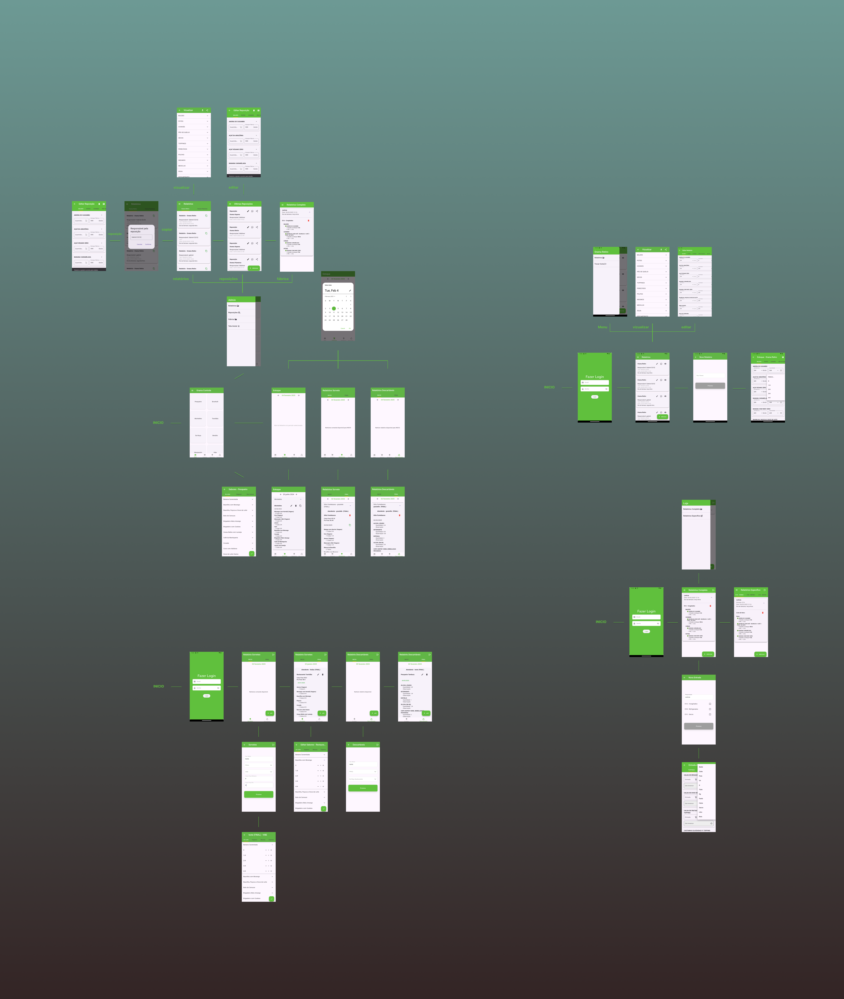

# Orama Admin

> **Orama Admin** é uma aplicação Flutter & Firebase que centraliza controle de estoque, relatórios de reposição, dashboard de vendas e painéis operacionais para todas as unidades Orama – fábrica, lojas e carrinhos móveis – com comportamento offline-first e atualizações via Shorebird.

<div align="center">

[](#tech-stack)
[](#tech-stack)
[](#)
[](#licença)

</div>

---

## Índice
1. [Funcionalidades](#funcionalidades)
2. [Tech Stack](#tech-stack)
3. [Arquitetura](#arquitetura)
4. [Primeiros Passos](#primeiros-passos)
5. [Estrutura de Pastas](#estrutura-de-pastas)
6. [Executando o Projeto](#executando-o-projeto)
7. [Build e Deploy](#build-e-deploy)
8. [Licença](#licença)

---

## Funcionalidades

| # | Funcionalidade | Detalhes |
|---|----------------|----------|
| 1 | **Dashboard de Vendas** | Visualização em tempo real de vendas por PDV, metas, evolução mensal e breakdown detalhado com gráficos FL Chart. |
| 2 | **Controle de Estoque** | Gestão centralizada de estoque com sincronização multi-Firestore entre fábrica, lojas e admin. |
| 3 | **Relatórios de Reposição** | Criar, copiar, editar e exportar relatórios de reposição com formulários reativo via MobX. |
| 4 | **Gestão de Sabores** | Administração completa de sabores de sorvete, insumos e descartáveis. |
| 5 | **Suporte Offline** | Leitura/escrita local quando offline, auto-sync quando o dispositivo reconecta via Connectivity Plus. |
| 6 | **Exportação PDF & Excel** | Geração de romaneios em PDF e planilhas Excel para compliance e compartilhamento. |
| 7 | **Gerenciamento de Usuários** | Cadastro de funcionários, locais e controle de acesso por unidade. |
| 8 | **Multi-Firebase** | Integração com 3 projetos Firebase: Admin (Firestore), Loja (Firestore) e Vendas (Realtime Database). |

---

## Tech Stack

| Categoria | Tecnologia |
|-----------|------------|
| **Framework** | Flutter `>=3.4.3` / Dart `>=3.4.3` |
| **Backend** | Firebase (Auth, Firestore, Realtime Database, Cloud Functions) |
| **State Management** | MobX + Provider |
| **Persistência Local** | GetStorage, SharedPreferences |
| **Gráficos** | FL Chart |
| **Exportação** | pdf, excel |
| **Conectividade** | Connectivity Plus, Internet Connection Checker |
| **Hot Updates** | Shorebird |

---

## Arquitetura

```
┌─────────────────┐     Firestore      ┌─────────────────┐
│   Orama Loja    │ ◀────────────────▶ │   Orama Admin   │
│  (Secondary)    │     (estoque)      │   (Primary)     │
└─────────────────┘                    └─────────────────┘
                                              │
                                              ▼
┌─────────────────┐   Realtime DB     ┌─────────────────┐
│   PDVs / Lojas  │ ────────────────▶ │  Sales Database │
│                 │    (vendas)       │                 │
└─────────────────┘                   └─────────────────┘
```

**Camadas:**
- **UI (Pages)** → Interface do usuário
- **Stores (MobX)** → Estado reativo da aplicação
- **Services** → Lógica de negócio e comunicação com Firebase
- **Models** → Estruturas de dados

---

## Primeiros Passos

### Pré-requisitos

- Flutter SDK `>= 3.4.3`
- Dart `>= 3.4.3`
- 3 projetos Firebase configurados (Admin, Loja, Vendas)

### Clone & Instalação

```bash
git clone https://github.com/rikelmyso7/orama_admin.git
cd orama_admin
flutter pub get
```

### Configuração Firebase

1. Configure o `firebase_options.dart` com as credenciais dos 3 projetos:
   - `DefaultFirebaseOptions` (Admin)
   - `SecondaryFirebaseOptions` (Loja)
   - `SalesFirebaseOptions` (Vendas - Realtime Database)

2. Adicione `google-services.json` na pasta `android/app/`

3. Gere os arquivos MobX:
```bash
flutter pub run build_runner build --delete-conflicting-outputs
```

---

## Estrutura de Pastas

```
lib/
├── main.dart                 # Entry point, inicialização Firebase
├── firebase_options.dart     # Configurações multi-Firebase
├── routes/                   # Definição de rotas
│   └── routes.dart
├── auth/                     # Autenticação
│   ├── authStateSwitcher.dart
│   └── login_page.dart
├── pages/                    # Telas da aplicação
│   ├── admin_page.dart
│   ├── dashboard_vendas_page.dart
│   ├── estoque_page.dart
│   ├── main_scaffold.dart
│   ├── splash_page.dart
│   ├── sabores_admin_page.dart
│   ├── loja/
│   │   ├── gerenciamento/    # CRUD funcionários, locais, estoque
│   │   ├── relatorios/       # Visualização de relatórios
│   │   └── reposicao/        # Gestão de reposições
│   └── vendas/               # Páginas de análise de vendas
│       ├── monthly_breakdown_page.dart
│       └── pdv_monthly_breakdown_page.dart
├── stores/                   # MobX Stores
│   ├── stock_store.dart
│   ├── comanda_store.dart
│   └── *.g.dart              # Arquivos gerados
├── vendas/                   # Módulo de vendas
│   ├── models/               # Modelos de dados
│   ├── constants/
│   ├── vendas_store.dart
│   ├── vendas_repository.dart
│   └── vendas_cache.dart
├── services/                 # Serviços
│   └── update_service.dart
├── utils/                    # Utilitários
│   ├── gerar_excel.dart
│   ├── gerar_romaneio.dart
│   └── ...
├── widgets/                  # Componentes reutilizáveis
│   ├── my_styles/            # Estilos customizados
│   ├── cards/                # Cards de UI
│   └── vendas/               # Widgets do módulo vendas
└── others/                   # Constantes e dados
    ├── constants.dart
    ├── sabores.dart
    └── insumos.dart
```

---

## Executando o Projeto

```bash
# Android
flutter run

# Com flavor específico (se configurado)
flutter run --flavor production
```

---

## Build e Deploy

### Android APK
```bash
flutter build apk --release
```

### Android App Bundle
```bash
flutter build appbundle --release
```

### Shorebird (Hot Updates)
```bash
shorebird release android
shorebird patch android
```

---

## Licença

**Projeto Proprietário** - Este repositório é público apenas para fins de portfólio e demonstração.

Você pode visualizar o código para fins educacionais, mas **não está autorizado** a usar, copiar, modificar ou distribuir este software para qualquer finalidade comercial.

Veja [`LICENSE`](LICENSE) para detalhes completos.

---

## Screenshots

<p align="center">
  
</p>

---

### Maintainer

<table>
  <tr>
    <td align="center">
      <br/>
      <b>Rikelmy Roberto</b><br/>
    </td>
  </tr>
</table>
